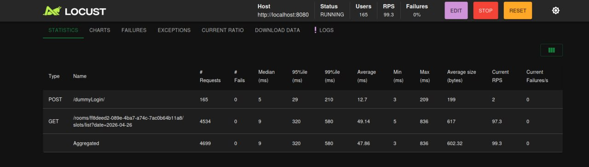

# Тестовое задание

В рамках тестового задания реализован бэкенд-сервис на **FastAPI** с использованием **SQLAlchemy** (асинхронный ORM) и **Alembic** для миграций.  

## Технологический стек

| Компонент | Технология |
|---|---|
| Фреймворк | FastAPI |
| ORM | SQLAlchemy 2.x (асинхронный) |
| Миграции | Alembic |
| Валидация данных | Pydantic v2 |
| Аутентификация | JWT |
| База данных | PostgreSQL |
| Тестирование | pytest, pytest-asyncio, requests |
| Логирование | logging |
| Управление конфигурацией | pydantic-settings |
| Контейнеризация | Docker, Docker Compose |

## Архитектура

Проект построен на основе **трёхслойной архитектуры** для чёткого разделения ответственности:

- **`app/api/` (Слой API):** Отвечает за обработку HTTP-запросов, валидацию данных с помощью схем Pydantic и вызов сервисного слоя. Здесь нет бизнес-логики.
- **`app/service/` (Сервисный слой):** Содержит всю основную бизнес-логику приложения. Обрабатывает данные, выполняет бизнес-правила и координирует взаимодействие с хранилищем.
- **`app/storage/` (Слой данных):** Абстрагирует работу с базой данных. Включает **Репозитории** для выполнения CRUD-операций и **модели SQLAlchemy** для описания структуры таблиц.

Вспомогательные модули:
- **`app/core/`:** Глобальная конфигурация и настройки логирования.
- **`app/infrastructure/`:** Компоненты для работы с внешними системами, например, сервис для работы с JWT.
- **`app/mappers/`:** Утилиты для преобразования данных между моделями SQLAlchemy и схемами Pydantic.

## Запуск и развёртывание

### Требования
- Docker
- Docker Compose

### Запуск проекта
1.  Склонируйте репозиторий.
2.  Убедитесь, что порт `8080` на вашем компьютере свободен.
3.  Выполните в корневой директории проекта:
    ```bash
    docker-compose up --build
    ```
    Эта команда соберёт образ, поднимет контейнеры с приложением и базой данных PostgreSQL. Сервис будет доступен по адресу `http://localhost:8080`.

    Для удобство у FastAPI есть встроенный swagger `http://localhost:8080/docs#`.

### Использование Makefile
Для удобства управления проектом был добавлен `Makefile`:

- `make up`: Запустить проект в фоновом режиме.
- `make down`: Остановить проект.
- `make delete`: Остановить проект и удалить все данные в БД.
- `make test_unit`: Запустить юнит-тесты.
- `make test_integration`: Запустить интеграционные тесты в отдельном изолированном окружении.

## Тестирование

В проекте реализовано два вида тестов:

- **Юнит-тесты (`/tests/unit`):** Проверяют бизнес-логику на сервисном слое в изоляции от внешних зависимостей. Запускаются командой `make test_unit`.
- **Интеграционные тесты (`/tests/integration`):** Тестируют сквозные сценарии взаимодействия компонентов (API → Сервис → БД), включая создание и отмену брони. Запускаются в отдельном Docker-контейнере с чистой базой данных. Выполняются командой `make test_integration`.
- **Тест нгрузки:** Для проверки нагрузки был написан маленький код для проверки нагрузки на `/rooms/{roomId}/slots/list` и мы её не проходим так как были сделаны при проектировании бд.

<div align="center">
  
  <p><i>Не проходим нагрузку</i></p>
</div>


## Миграции базы данных

Миграции управляются с помощью **Alembic**. Они находятся в папке `/migrations` и применяются автоматически при старте приложения для поддержания схемы БД в актуальном состоянии.

## Принятые архитектурные решения

1. **Пагинация для списка переговорок** — добавлена для `/rooms/list`, так как переговорок может быть много.  
2. **Слоты на дату** — при запросе `/rooms/{roomId}/slots/list` возвращаются только актуальные (не прошедшие) слоты. Если запрошена прошедшая дата, возвращается ошибка 400.  
3. **Создание брони** — добавлена проверка, что слот актуален (не в прошлом).  
4. **Список броней пользователя** — эндпоинт `/bookings/my` возвращает только активные брони на будущие слоты, что соответствует бизнес-требованию.  
5. **Генерация слотов**  
   - Выбран подход когда слоты создаются при первом запросе доступных слотов для конкретной даты.  
   - Такой вариант не лучший так как лучше было бы совместить с авто генерациями на месяц вперёд так как это снизит нагрузку основную на бд а те слоты которые превышают месяц применить первый способ и поставишь redis для кеширования 

6.  **Makefile:** Для упрощения работы с проектом (`make up`, `make test_*` и т.д.).

